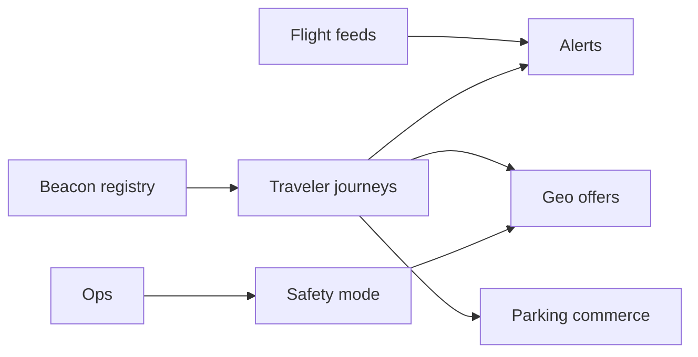

# ApronLink

**Source:** `ai-in-iot/Accenture-riogaleao-airport-IOT-digital-transportation-experience/`
**Domain:** `ai-iot`
**One-liner:** Delivers beacon-accurate, personalized airport journeys—wayfinding, flight alerts, offers, parking pay—so hubs absorb demand spikes (Olympics-scale) while unlocking partner revenue on a shared connected-travel fabric.
**Wedge:** Large airports and transport hubs needing a 1:1 traveler channel in months, not years—RIOgaleão’s five-month Olympics readiness bar.
**Positioning:** Connected travel experience platform. Case: RIOgaleão faced +~500k sports fans atop daily traffic; Accenture Connected Travel Platform integrated spaces, systems, and mobile with ~3,000 geo-beacons for check-in-to-gate guidance, 60 minutes free Wi-Fi, flight status, exclusive offers, and parking payment—creating post-event partnership and revenue options with flexible new service launch.

## Market research synthesis

### Thesis from source

Airports must differentiate traveler experience and find ancillary revenue while operating under immovable event deadlines. RIOgaleão needed a smart, integrated engagement model ready in five months. Approach: high-level digital roadmap; open Connected Travel Platform spanning physical spaces, equipment, tech systems, and mobiles for consistent contextual experiences in real time; mobile app for flight status, alerts, offers, free internet, beacon wayfinding (check-in to food), and parking pay. Results: deeper traveler relationships, location + flight + commerce on device, new partnerships/revenue, and ability to launch services (parking reservations, app payments) quickly after the Games.

### Buyer & economic model

- **Primary buyer:** Chief Commercial / Passenger Experience officer at airport operators or hub consortia.
- **Users:** traveler-app PMs, retail concession partners, ops control, IT integration, wayfinding teams.
- **Budget owner / value metric:** non-aeronautical revenue + CSAT. Metrics: app engagement, offer conversion, wayfinding task success, time-to-launch new service.
- **Competing status quo:** static signage, SMS blast alerts, siloed airline apps, no indoor accuracy.

### Domain constraints

- **Regulatory / trust / safety:** location privacy, PCI for payments, aviation security messaging rules.
- **Data sensitivity:** traveler identity, precise indoor location, payment tokens.
- **Change-management realities:** airlines, retail, and ops must share one fabric without losing brand control.

## Business requirements

- BR-1: Traveler journeys must be contextual from curb/arrival through gate with beacon-grade location.
- BR-2: Flight status and disruption alerts publish within agreed latency SLAs.
- BR-3: Offers are geo- and journey-stage targeted with partner attribution.
- BR-4: Parking reservation and payment complete in-app without desk diversion.
- BR-5: New services can be launched without rewriting the core journey fabric.
- BR-6: Free connectivity grants (e.g., timed Wi-Fi) are policy-configurable per campaign.
- BR-7: Location retention defaults minimize precision after journey ends.
- BR-8: Ops can suppress commercial pushes during safety/security events.
- BR-9: Partner revenue share reports are auditable per offer redemption.
- BR-10: Commercial packaging prices by beacon count, MAU, and partner seats.
- BR-11: Multilingual content supports major event visitor mixes.
- BR-12: Integration adapters cover AODB/flight info, parking, and payment providers.

## User stories

Canonical user stories live in sibling [USER_STORIES.md](USER_STORIES.md).

## System design

### Overview

ApronLink registers beacons and zones, builds traveler journeys, pushes flight/ops alerts, serves geo-offers, and handles parking commerce on a shared open travel fabric.

### Actors & boundaries

- **Actors:** travelers, PX PMs, partners, ops, IT, payment/parking systems, AODB.
- **Trust boundary:** ApronLink orchestrates experience and partner commerce; does not replace ATC or security SoR.
- **Human-in-the-loop points:** safety-mode activation, partner offer approval, service launch go-live.

### Core capabilities

1. **Beacon & zone registry** — indoor positioning graph.
2. **Traveler journeys** — stage-aware sessions.
3. **Flight & travel alerts** — disruption messaging.
4. **Geo offers** — partner promotions.
5. **Parking commerce** — reserve/pay.
6. **Connectivity grants** — timed Wi-Fi policy.
7. **Safety mode** — suppress commerce.
8. **Partner settlement** — attribution & revenue share.

### Conceptual data

- **Primary entities:** Traveler, Beacon, Zone, Journey, Alert, Offer, Redemption, ParkingSession, SafetyModeEvent.
- **Critical events:** zone enter, alert sent, offer redeemed, parking paid, safety mode on.
- **Retention / audit needs:** payments and settlements retained per PCI/finance; precise location minimized post-journey.

### Integrations (conceptual)

- **Systems of record:** AODB/FIDS, parking, payment, captive portal Wi-Fi, CRM.
- **Upstream signals:** beacon telemetry, flight updates, partner catalogs.
- **Downstream actions:** push notifications, door/parking barriers, settlement files.

### High-level architecture

### Success metrics

- **Leading:** wayfinding task completion; alert open rate; offer CTR.
- **Lagging:** CSAT; non-aero revenue lift; time-to-launch new service.

## OpenAPI skeleton

Canonical HTTP surface lives in sibling `openapi.yaml`. Summarize here:

- **Base path:** `/v1/...`
- **Auth:** API key and/or Bearer JWT (operator)
- **Resource groups:** Beacons, Journeys, Alerts, Offers, Parking
