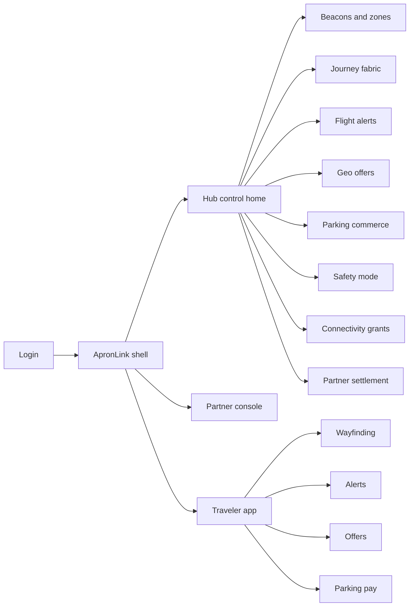
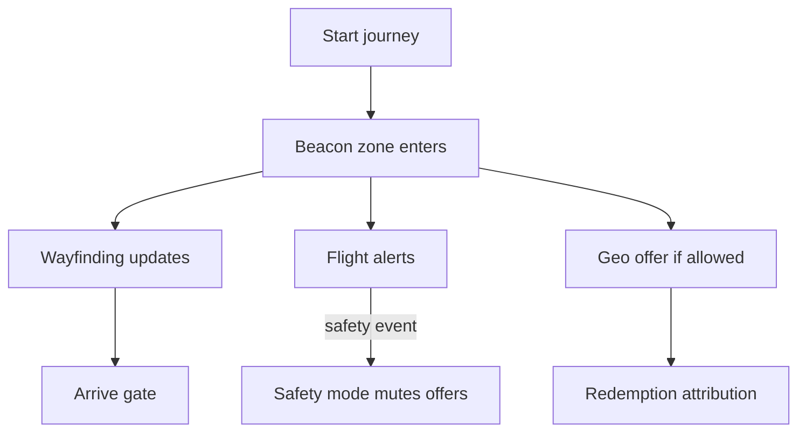

# ApronLink — Web app

**Product:** [PRODUCT.md](./PRODUCT.md)
**Primary surface:** Hub experience control plane (PX / ops / commercial)
**Secondary surfaces:** Traveler mobile journey client (wayfinding, alerts, offers, parking); partner offer console (venue-scoped)
**Design thesis:** ApronLink is the apron-to-gate fabric for personalized travel — one channel where beacon location, flight truth, and partner commerce meet without letting retail override safety. The UI metaphor is a terminal spine: curb → check-in → security → gate, with beacons as luminous waypoints. Visual language is runway-light amber and terminal glass-cyan on deep night-blue (aviation night ops, not tourist brochure teal). Safety mode extinguishes offer glow instantly. The ApronLink wordmark sits on every alert and settlement screen so hubs know which fabric carried the Olympics-scale spike.

## UX research synthesis

### Category peers (best-in-class)

- **SITA Passenger Processing / Smart Path:** Stage-aware airport journeys with ops-controlled messaging. Steal: single source of truth for disruption vs airline-app cacophony; reject replacing security SoR.
- **Mappedin / IndoorAtlas wayfinding consoles:** Beacon/zone graphs with path success metrics. Steal: indoor graph as operable asset with health of ~beacon fleets; reject arcade AR overlays as the primary PX control.
- **Amadeus Airport / retail media suites:** Geo- and stage-targeted offers with partner attribution. Steal: redemption-linked revenue share; reject spray SMS blasts without journey stage.
- **Changi / hub super-app patterns:** Parking pay, connectivity grants, multilingual event modes. Steal: service launch without rewriting the spine; reject locking PX into a single airline brand shell.

### Patterns to adopt / reject

- **Adopt:** Beacon-grade zone spine; flight alert SLA; geo+stage offers with attribution; in-app parking pay; safety-mode commerce mute; timed Wi-Fi grants; location retention minimization; multilingual event packs; partner venue scopes.
- **Reject:** Map as the only home for ops; ads during security events; permanent free Wi-Fi without policy; precise location hoarding post-journey; purple “smart airport AI” panels; partner cross-visibility of competitor offers.

### Trust, density, and workflow constraints from PRODUCT.md

Aviation security messaging and PCI constrain commerce (BR-4, BR-8). Location privacy defaults minimize precision after journey end (BR-7). Flight alerts must meet latency SLAs (BR-2). Partners need auditable attribution (BR-9). New services plug into the fabric without rewrite (BR-5). Density for operators favors alert queues and beacon health over traveler-app screenshots; traveler client stays one job per screen (wayfind / alert / pay).

## Information architecture

### Nav model

### Roles → default home

| Role | Default home | Why |
|------|--------------|-----|
| Traveler experience PM | Hub control home — journey + beacon health | Curb-to-gate paths (BR-1) |
| Airport ops | Flight alerts + safety mode | One truth channel (BR-2, BR-8) |
| Concession partner | Partner console — my venues/offers | Attribution without competitor leak |
| Commercial lead | Settlement + time-to-launch | Non-aero revenue (BR-9, BR-5) |
| Traveler | Traveler app — active journey | Wayfind / alert / pay |
| Support agent | Privacy revoke tools | Location history on request |
| Admin | Partner API scopes | Venue isolation (BR-10) |

### Cross-links to OpenAPI resources

| Nav area | OpenAPI tags / resources |
|----------|---------------------------|
| Beacon / zone registry | Beacons |
| Traveler journeys / zones | Journeys |
| Flight & ops alerts | Alerts |
| Geo offers / redemptions | Offers |
| Parking reserve / pay | Parking |

## Screen inventory

### Hub control home

- **Purpose:** Answer “are travelers finding gates, getting truthy alerts, and is commerce muted when safety demands it?” in one composition.
- **Entry:** Post-login for PX/ops.
- **Layout regions:** Brand + terminal switcher; spine health (beacon up %, alert SLA, active journeys, safety-mode state); disruption queue; offer mute indicator; parking funnel pulse.
- **Primary actions:** Activate safety mode; open alert composer; open dead beacon cluster.
- **Empty / loading / error:** Empty = register beacon graph; loading = skeleton spine; error = retry with request id.
- **BR / story ties:** BR-1, BR-2, BR-8.

### Beacon and zone registry

- **Purpose:** Operate the indoor positioning graph (thousands of beacons) as a living asset.
- **Entry:** Nav → Beacons.
- **Layout regions:** Terminal map/list hybrid; beacon health; zone taxonomy (check-in, food, gate); path coverage gaps.
- **Primary actions:** Register beacon; retire; mark zone; export coverage.
- **Empty / loading / error:** Coverage gap = amber path warning; offline cluster = coral.
- **BR / story ties:** BR-1, BR-10.

### Journey fabric designer

- **Purpose:** Define stage-aware traveler sessions from curb/arrival through gate.
- **Entry:** Journeys nav; PX PM.
- **Layout regions:** Stage spine editor; trigger rules (zone enter); multilingual content slots; event campaign overlay (Olympics-scale).
- **Primary actions:** Publish journey template; A/B path; preview traveler steps.
- **Empty / loading / error:** Missing stage = cannot publish.
- **BR / story ties:** BR-1, BR-5, BR-11.

### Flight and disruption alerts

- **Purpose:** Publish flight status and disruptions within SLA on the same channel as wayfinding.
- **Entry:** Ops default; Alerts.
- **Layout regions:** Alert queue; SLA timer; AODB sync status; audience (journey stage / flight); suppress-commerce linkage.
- **Primary actions:** Compose; send; cancel; escalate to safety mode.
- **Empty / loading / error:** Feed lag beyond SLA = coral banner.
- **BR / story ties:** BR-2, BR-12; ops stories.

### Geo offers studio

- **Purpose:** Stage- and geo-targeted partner promotions with attribution — never spray.
- **Entry:** Offers nav; partner console (scoped).
- **Layout regions:** Offer list; zone/stage targeting; approval state; redemption forecast; safety-mode compatibility flag.
- **Primary actions:** Create offer; submit approval; pause; view attribution.
- **Empty / loading / error:** Safety mode on = offers greyed with mute reason.
- **BR / story ties:** BR-3, BR-8; partner stories.

### Parking commerce

- **Purpose:** Reserve and pay parking in-app without desk diversion.
- **Entry:** Parking nav; traveler parking flow.
- **Layout regions (ops):** Session table; payment provider health; exception queue. **(traveler):** spot/time → pay → confirmation.
- **Primary actions:** Ops: refund/exception; Traveler: reserve, pay.
- **Empty / loading / error:** Provider down = block pay with desk fallback message.
- **BR / story ties:** BR-4, BR-12.

### Connectivity grants

- **Purpose:** Policy-configure timed free Wi-Fi (e.g., 60 minutes) per campaign without permanent free-ride.
- **Entry:** Wi-Fi / grants nav.
- **Layout regions:** Grant policies; campaign windows; captive portal status; abuse metrics.
- **Primary actions:** Create grant window; expire; extend event campaign.
- **Empty / loading / error:** Expired policy = captive portal deny explained.
- **BR / story ties:** BR-6; ops Wi-Fi story.

### Safety mode

- **Purpose:** One control to suppress commercial pushes during safety/security events.
- **Entry:** Always reachable from hub chrome; dedicated screen.
- **Layout regions:** Mode state; active mutes; alert priority override; audit who activated.
- **Primary actions:** Activate; deactivate with reason; notify partners.
- **Empty / loading / error:** Activation failure = hard alarm (must not silently fail).
- **BR / story ties:** BR-8; PX safety-mode story.

### Partner settlement

- **Purpose:** Auditable revenue share per offer redemption.
- **Entry:** Commercial lead; Settle nav.
- **Layout regions:** Redemption ledger; partner share; period export; dispute notes.
- **Primary actions:** Export settlement; open redemption evidence.
- **Empty / loading / error:** Empty period = no redemptions message.
- **BR / story ties:** BR-9.

### Traveler wayfinding (mobile)

- **Purpose:** Beacon-accurate path from check-in to gate/food with one clear next step.
- **Entry:** Traveler app default during active journey.
- **Layout regions:** Next waypoint; remaining time/distance estimate; flight context chip; alert interrupt slot.
- **Primary actions:** Start navigation; open alert; switch language.
- **Empty / loading / error:** Beacon lost = reacquire guidance; offline = cached last path.
- **Mobile notes:** Thumb-first; one job; alert interrupts offers.
- **BR / story ties:** BR-1, BR-11.

### Privacy revoke (support)

- **Purpose:** Revoke location history on traveler request.
- **Entry:** Support tools.
- **Layout regions:** Traveler lookup; location retention state; revoke confirm; audit.
- **Primary actions:** Revoke; export confirmation.
- **Empty / loading / error:** Already minimized = show retention policy status.
- **BR / story ties:** BR-7; exception path.

## Key flows

1. **Curb-to-gate journey** — traveler starts journey → beacon zones update stage → wayfinding + flight alerts → optional geo offer if not safety-muted → gate arrival; failure: beacon gap or alert SLA miss.

2. **Safety mute** — ops activates safety mode → offers suppressed → security alerts prioritized → partners notified → deactivate with audit.

3. **Parking pay** — traveler reserves → PCI pay → barrier/ entitlement → session on ops ledger.

4. **Event Wi-Fi grant** — commercial sets 60-minute grant → captive portal enforces → auto-expire post-campaign.

5. **Partner settlement** — redemptions accumulate → period share report → export for finance.

## Design system

### Tokens (CSS variables)

- `--color-ink: #E8EEF4` — primary text
- `--color-night-950: #070B14` — app ground (night ops)
- `--color-night-900: #0F1624` — panels
- `--color-runway: #E8B84A` — runway-light amber (alerts, CTAs)
- `--color-glass: #5CB8C9` — terminal glass cyan (wayfinding / beacons)
- `--color-glass-dim: #1F5A66` — cyan on dark
- `--color-mute: #6B7280` — safety-muted commerce
- `--color-safe: #D94F3D` — safety mode active
- `--color-pass: #4CAE7A` — SLA healthy / paid
- `--color-brand: #F0D08A` — ApronLink wordmark
- `--font-display: "Barlow Condensed", sans-serif` — spine titles and timers
- `--font-body: "Barlow", sans-serif` — body
- `--font-mono: "IBM Plex Mono", monospace` — beacon ids, flight numbers, SLA ms
- `--space-1`…`--space-8`: 4px scale
- `--radius-sm: 4px`; `--radius-md: 10px` — terminal glass, not pill carnival
- `--motion-beacon: 200ms ease-out` — waypoint pulse
- `--motion-safety: 160ms ease-in` — offer glow extinguish
- Atmosphere: night-terminal vignette; soft glass reflections on zone panels; traveler app uses real terminal photography sparingly as wayfind context — not stock happy-tourist collage as the control-plane chrome.

### Typography & brand

- Condensed display for stage spine and SLA timers; mono for flight numbers and beacon IDs.
- Wordmark on alerts, safety mode, and settlement.
- Traveler first viewport: brand + next waypoint + one supporting line + primary navigate CTA — no offer carousel in the hero.

### Do / don’t

- **Do:** Safety mode as chrome-level control; SLA-visible alerts; attribution-only offers; minimize location post-journey; multilingual event packs.
- **Don’t:** Ads during safety mode; permanent free Wi-Fi; competitor offer bleed; purple smart-city glow; dashboard-of-everything as traveler home.

### Accessibility & domain trust cues

- Safety mode announced via live region and non-colour banner.
- Contrast AA+ on runway amber and glass cyan against night ground.
- Focus: alerts before offers; pay forms clearly labeled PCI.
- Traveler wayfinding works with VoiceOver/TalkBack step announcements.

## Component patterns

- **TerminalSpine** — curb→gate stage rail with active zone.
- **BeaconHealthDot** — up/degraded/offline per cluster.
- **AlertSlaTimer** — latency vs agreed SLA.
- **SafetyModeSwitch** — extinguishes commercial glow.
- **GeoOfferTarget** — zone + journey-stage chips.
- **RedemptionLedgerRow** — attribution for settlement.
- **WifiGrantWindow** — timed connectivity policy.
- **ParkingPaySheet** — reserve → pay → confirm.
- **LocationRetainBadge** — precision minimized post-journey.

## Out of scope for v1 web

- ATC/security systems of record; airline PSS replacement; full retail POS; AR wayfinding headset client; global multi-airport SaaS marketplace beyond hub tenancy; automatic biometric boarding (integrates later via adapters only).
